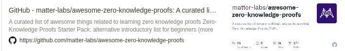
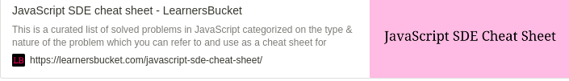
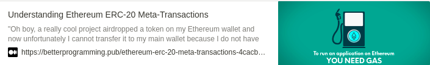

# Things I'm Doing/ Should be doing

- [ ] [A zk starknet blog](https://hackmd.io/@dcbuild3r/Bkj2L02uq)
-- [ ] [Zero knowledge](https://github.com/matter-labs/awesome-zero-knowledge-proofs)
      
- [ ] [Math in Solidity](https://medium.com/coinmonks/math-in-solidity-part-3-percents-and-proportions-4db014e080b1)
      
- [ ] [JS SDE Cheat Sheet](https://learnersbucket.com/javascript-sde-cheat-sheet/)
      
- [ ] [Meta transactions](https://betterprogramming.pub/ethereum-erc-20-meta-transactions-4cacbb3630ee)
      
- [ ] [Hashstack](https://blog.hashstack.finance/deconstructing-hashstacks-dynamic-interest-algorithm-dial/)

- [ ] [Potocol](https://github.com/0xHashstack/whitepaper/tree/main/Open%20protocol/v1.0%5Bdraft%5D)
