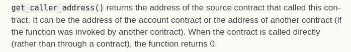
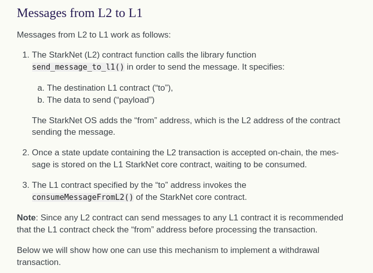
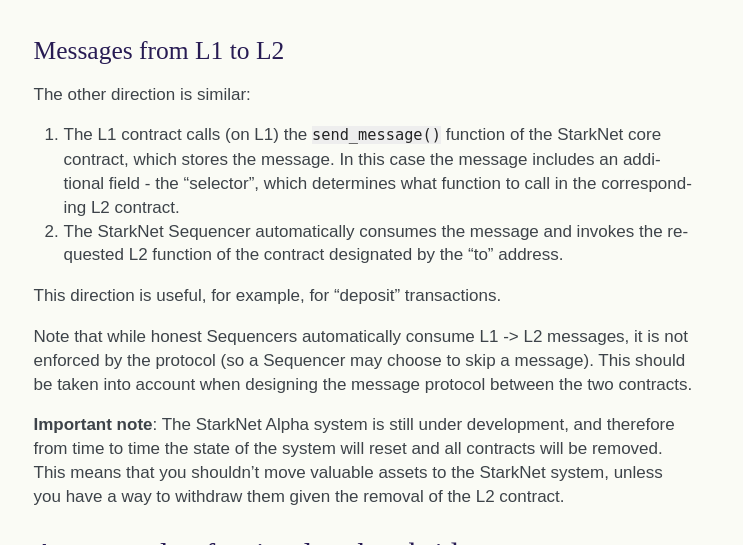

# Starknet specific contract shiz

## Getting caller address

```rust
from starkware.starknet.common.syscalls import get_caller_address
let (caller_address) = get_caller_address()
```

if contract is called directly rather than through another contract this returns 0, (but i have seen it return an address even if an account invokes it)?

**kinda sus**

## Reqiures, cairo version

```rust
from starkware.cairo.common.math import assert_nn

# Increases the balance of the user by the given amount.
@external
func increase_balance{
    syscall_ptr : felt*,
    pedersen_ptr : HashBuiltin*,
    range_check_ptr,
}(amount : felt):
    # Verify that the amount is positive.
    with_attr error_message(
            "Amount must be positive. Got: {amount}."):
        assert_nn(amount)
    end
    return ()
end
```

## Constructor

- runs once at deploy
- `constructor` decorator and `constructor` name of function
- during deploy number of arguments must match constructor signature otherwise depoy will fail

```rust
@storage_var
func owner() -> (owner_address : felt):
end

@constructor
func constructor{
    syscall_ptr : felt*,
    pedersen_ptr : HashBuiltin*,
    range_check_ptr,
}(owner_address : felt):
    owner.write(value=owner_address)
    return ()
end
```

## Structuring storage

### Multiple values

```rust
@storage_var
func range(user : felt) -> (res : (felt, felt)):
end
```

- set and read storage var

```rust
@external
func extend_range{
    syscall_ptr : felt*,
    pedersen_ptr : HashBuiltin*,
    range_check_ptr,
}(user : felt):
    let (min_max) = range.read(user)
    range.write(user, (min_max[0] - 1, min_max[1] + 1))
    return ()
end
```

### Storing structs

```rust
struct User:
    member first_name : felt
    member last_name : felt
end

@storage_var
func user_voted(user : User) -> (res : felt):
end

@external
func vote{
    syscall_ptr : felt*,
    pedersen_ptr : HashBuiltin*,
    range_check_ptr,
}(user : User):
    user_voted.write(user, 1)
    return ()
end
```

## Passing complex data types as calldata

### Array

```rust
@external
func compare_arrays(
    a_len : felt, a : felt*, b_len : felt, b : felt*
):
    return ()
end
```

To call this you mention len and then the array elements

```rust
starknet invoke \
    --address CONTRACT_ADDRESS \
    --abi contract_abi.json \
    --function compare_arrays \
    --inputs 4 10 20 30 40 2 50 60
```

### Structs and tuples

```rust
struct Point:
    member x : felt
    member y : felt
end

@view
func sum_points(points : (Point, Point)) -> (res : Point):
    return (
        res=Point(
        x=points[0].x + points[1].x,
        y=points[0].y + points[1].y),
    )
end
```

- inorder to pass arguements `(1,2)` and `(10, 20)` pass as shown

```rust
starknet call \
    --address CONTRACT_ADDRESS \
    --abi contract_abi.json \
    --function sum_points \
    --inputs 1 2 10 20
```

### Passing arrays of structs

- works if struct doesn't have any pointers

```rust
@external
func sum_points_arr(a_len : felt, a : Point*) -> (res : Point):
    return ()
end
```

- call like this

```rust
starknet call \
    --address CONTRACT_ADDRESS \
    --abi contract_abi.json \
    --function sum_points_arr \
    --inputs 3 1 2 10 20 100 200
```

## Transaction information

```rust
from starkware.starknet.common.syscalls import get_tx_info
func get_tx_max_fee{syscall_ptr : felt*}() -> (max_fee : felt):
    let (tx_info) = get_tx_info()

    return (max_fee=tx_info.max_fee)
end
```

- this returns a struct with the info as below

```rust
struct TxInfo:
    # The version of the transaction. It is fixed (currently, 0) in the OS, and should be
    # signed by the account contract.
    # This field allows invalidating old transactions, whenever the meaning of the other
    # transaction fields is changed (in the OS).
    member version : felt

    # The account contract from which this transaction originates.
    member account_contract_address : felt

    # The max_fee field of the transaction.
    member max_fee : felt

    # The signature of the transaction.
    member signature_len : felt
    member signature : felt*

    # The hash of the transaction.
    member transaction_hash : felt

    # The identifier of the chain.
    # This field can be used to prevent replay of testnet transactions on mainnet.
    member chain_id : felt
end
```

## Block and timestamp

```rust
from starkware.starknet.common.syscalls import (
    get_block_number,
    get_block_timestamp,
)
let (block_number) = get_block_number()
let (block_timestamp) = get_block_timestamp()
```

- here `block_timestamp` is at the time of block creation which will be very different from the actual  
  timestamp at the time of acceptance into L1

## Calling another contract

- write the interface for the contract you want to call
- this includes declarations of external functions you want to use

eg:

```rust
@contract_interface
namespace IBalanceContract:
    func increase_balance(amount : felt):
    end

    func get_balance() -> (res : felt):
    end
end

@external
func call_increase_balance{syscall_ptr : felt*, range_check_ptr}(
    contract_address : felt, amount : felt
):
    IBalanceContract.increase_balance(
        contract_address=contract_address, amount=amount
    )
    return ()
end
```

- Use it like this
- in addition to `contract_address` arguement `syscall_ptr` and `range_check_ptr` are also required

## Get current contract's address

```rust
from starkware.starknet.common.syscalls import (get_contract_address)

let (contract_address) = get_contract_address()
```

- Same as `address(this)` in solidity

## Library calls

- invoke contract class in the context of a given contract
- storage changing operations change the state of the calling contract

```rust
@storage_var
func balance() -> (res : felt):
end

@external
func increase_my_balance{syscall_ptr : felt*, range_check_ptr}(
    class_hash : felt, amount : felt
):
    # Increase the local balance variable using a function from a
    # different contract class using a library call.
    IBalanceContract.library_call_increase_balance(
        class_hash=class_hash, amount=amount
    )
    return ()
end
```

in default function of proxy

```rust
@external
@raw_input
@raw_output
func __default__{
    syscall_ptr : felt*,
    pedersen_ptr : HashBuiltin*,
    range_check_ptr,
}(selector : felt, calldata_size : felt, calldata : felt*) -> (
    retdata_size : felt, retdata : felt*
):
    let (class_hash) = implementation_hash.read()

    let (retdata_size : felt, retdata : felt*) = library_call(
        class_hash=class_hash,
        function_selector=selector,
        calldata_size=calldata_size,
        calldata=calldata,
    )
    return (retdata_size=retdata_size, retdata=retdata)
end
```

## Deploying contract by another contract

Contract class of the contract must be declared before invoking the deploy system call

```rust
func deploy{syscall_ptr : felt*}(
    class_hash : felt,
    contract_address_salt : felt,
    constructor_calldata_size : felt,
    constructor_calldata : felt*,
    deploy_from_zero : felt,
) -> (contract_address : felt):
end
```

- `class hash`: of the conract to deploy
- `salt`: randomised
- `constructor call data size`
- `constructor call data`: pointer to array containing constructor data
- `deploy from zero`: to show if deployer address will affect new address or not, if `true` address of  
  deployer used, if `false` 0 is used

  ## Events

Defining an event

```rust
@event
func increase_balance_called(current_balance: felt, amount: felt):
end
```

To use event

```rust
increase_balance_called.emit(current_balance=res, amount=amount)
```

## Interacting with L1

### L2 to L1



```rust
@external
func withdraw{
    syscall_ptr : felt*,
    pedersen_ptr : HashBuiltin*,
    range_check_ptr,
}(user : felt, amount : felt):
    # Make sure 'amount' is positive.
    assert_nn(amount)

    let (res) = balance.read(user=user)
    tempvar new_balance = res - amount

    # Make sure the new balance will be positive.
    assert_nn(new_balance)

    # Update the new balance.
    balance.write(user, new_balance)

    # Send the withdrawal message.
    let (message_payload : felt*) = alloc()
    assert message_payload[0] = MESSAGE_WITHDRAW
    assert message_payload[1] = user
    assert message_payload[2] = amount
    send_message_to_l1(
        to_address=L1_CONTRACT_ADDRESS,
        payload_size=3,
        payload=message_payload,
    )

    return ()
end
```

### L1 to L2



```rust
@l1_handler
func deposit{
    syscall_ptr : felt*,
    pedersen_ptr : HashBuiltin*,
    range_check_ptr,
}(from_address : felt, user : felt, amount : felt):
    # Make sure the message was sent by the intended L1 contract.
    assert from_address = L1_CONTRACT_ADDRESS

    # Read the current balance.
    let (res) = balance.read(user=user)

    # Compute and update the new balance.
    tempvar new_balance = res + amount
    balance.write(user, new_balance)

    return ()
end
```

## Entry Point

## **default** entry point

[library call](#library-calls)

## **l1_default** entry point

```rust
from starkware.starknet.common.syscalls import (
    library_call_l1_handler,
)

@l1_handler
@raw_input
func __l1_default__{
    syscall_ptr : felt*,
    pedersen_ptr : HashBuiltin*,
    range_check_ptr,
}(selector : felt, calldata_size : felt, calldata : felt*):
    let (class_hash) = implementation_hash.read()

    library_call_l1_handler(
        class_hash=class_hash,
        function_selector=selector,
        calldata_size=calldata_size,
        calldata=calldata,
    )
    return ()
end
```

- using `library_call_l1_handler` outside of `__l1_default__` is risky don't do that shit

## Signature Verification

- best way to handle auth. is by using account contracts, using assert basic shiz

```ts
from starkware.cairo.common.cairo_builtins import (
    HashBuiltin,
    SignatureBuiltin,
)
from starkware.cairo.common.hash import hash2
from starkware.cairo.common.signature import (
    verify_ecdsa_signature,
)
@external
func increase_balance{
    syscall_ptr : felt*,
    pedersen_ptr : HashBuiltin*,
    range_check_ptr,
    ecdsa_ptr : SignatureBuiltin*,
}(user : felt, amount : felt, sig : (felt, felt)):
    # Compute the hash of the message.
    # The hash of (x, 0) is equivalent to the hash of (x).
    let (amount_hash) = hash2{hash_ptr=pedersen_ptr}(amount, 0)

    # Verify the user's signature.
    verify_ecdsa_signature(
        message=amount_hash,
        public_key=user,
        signature_r=sig[0],
        signature_s=sig[1],
    )

    let (res) = balance.read(user=user)
    balance.write(user, res + amount)
    return ()
end
```

- `verify_ecdsa_signature()` behaves like an assert statement here
