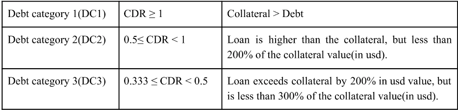

# White Paper Simplified

```
Essentially, people can take a loan keeping their current tokens as colllateral
hence not losing their positions. This loan is also a leveraged loan.
Where of the collateral 70% can only be withdraw by the person and the rest is
held by the protocol. Upon crossing a certain threshold for value of loan it gets
liquidated by liquidators incetivised by taking a small profit off the assets that the
borrower purchased on the platform. If no liquidators pick it up then the protocol
liquidates it in a centralised manner.
```

## Problem

Problems in current DeFi as compared to tradefi

- Over collateralisation is a downgrade from tradefi
- Massively fluctuating interest rates

What Hashstack does:

- Set apr, apy depending on commitment periods
- Effective asset utilization
- Under collateralised loans


## Open Protocol

- Primary market: deposits and loans here
- Secondary market: borrowed loans can be swapped to and from secondary market

1 epoch = 3 secs

### Deposit Flow

#### Fixed Deposits

1. Connect Account
2. Choose deposit market, deposit type(fixed, flexible) minimum commitment period
3. Transfer funds to reserve

Protocol offers dividends to fixed deposit when net difference of monthly yield with monthly percentage yield is positive

#### Flexible Deposits

don't offer dividends, earn a fixed apy of 7.8% since no lock in period

### Borrower Flow

Borrower must provide collateral 33% or more of loan sum.

- Fixed loans: pay 15%, deployed as fixed deposit gets 10% with no dividends
- Flexible loans: 18%

Protocol deploys collateral as a fixed deposit with mcp of 2 weeks earning 10% apy on collateral, no dividends here

3 Day Timelock on collateral of loans, to retrieve collateral deployed collateral for release/withdrawal.

- Using Paraswap integration you can swap loans into secondary markets.

### Permissible Withdrawal

Permissible Withdrawal = min(70% collateral, 100% loan value);

### Accrued yield

- Balances updated everytime user uses protocol, reduces operational costs
- For debt usdt equivalent is deducted from collateral till collateral is no longer in acceptable CDR range

### Liquidation



When collateral is near liquidation price notification is sent to user, Liquidation trigger passed with price:


Based on category liquidation price set, upon breaching this price the loan is liquidated.  


### Liquidator

- Any one with enough HASH deposits as a 3 month mcp
- Liquidators incentivised to liquidate over levereged loans (lower CDR) since greater discount of 2.4% per type of loan.
- fail safe liquidation: automated liquidation if liquidation discount drops by 25% with no takers. (where does 25% come from?)
- Liquidator processed liquidations, shared between protocol and liquidator (3:7), no discount sharing for protocol processed liquidation

## Updated Interest Rates, Dynamic Interest Algorithm

- Interest rate model that charges borrowers an apr just above the amount needed to repay the depositors. (like a rainy day fund)
  
- x is the offset, can be set in the future by governance as well
- why are we getting a random number in between range didn't make sense?
- correlation between different locking periods is 1.2 on testnet as well
