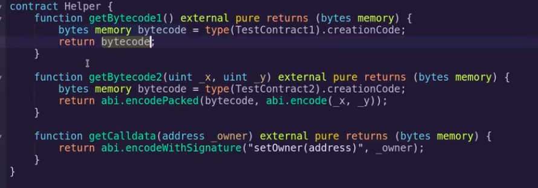

## Deploy Contracts from Another Contract

```ts
pragma solidity ^0.8.7;

contract TestContract1{
    address public owner = msg.sender;

    function setOwner(address _owner)public {
        require(msg.sender == owner, "not owner");
        owner = _owner;
    }
}

contract TestContract2{
    address public owner = msg.sender;
    uint public value = msg.value;
    uint public x;
    uint public y;

    constructor(uint _x, uint _y) payable {
        x = _x;
        y = _y;
    }
}

contract Proxy{
    fallback() external payable{}
    function deploy(bytes memory _code) external payable returns(address addr){
        event Deploy(address);
        // new TestContract1(); this isn't very dynamic so we use assemble instead
        assembly{
            // create(v, p, n)
            // v = amount of ETH to send
            // p = pointer in memory to start of code
            // n = size of code
            // msg.value doesn't work inside assembly so you use callvalue
            addr :=create(callvalue(), add(_code, 0x20), mload(_code));
        }
        require(addr != address(0), "deploy failed");
        emit Deploy(addr);
    }

    function execute(address _target, bytes memory _data) external payable{
        (bool success, ) = _target.call{value: msg.value}(_data);
        require(success, "execution failed");
    }
}
```

First 32 bytes encodes the length of the code, so we skip the first 32 bytes in the `create()` call

The function deploy, is used to deploy any contract just using it's byte code

Although the required bytecode can be got using other tools this is how to do it using solidity.


Inorder to set the constructor for TestContract2 we are using `abi.encodePacked`

## Storage, Memory and Calldata

- Storage: state variable stored on blockchain
- Memory: data loaded onto memory
- Calldata: like memory but can only be used for function inputs
