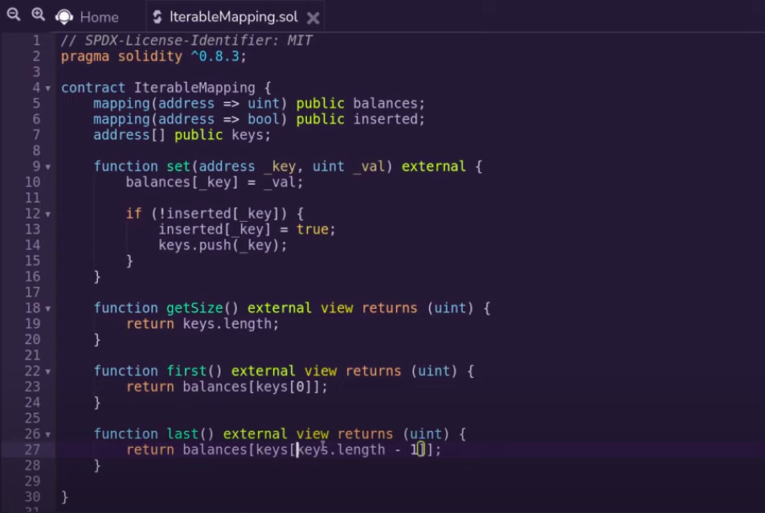
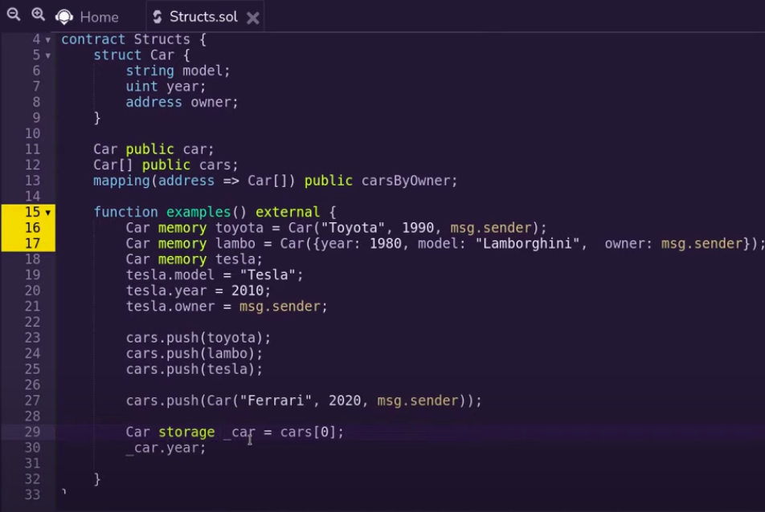
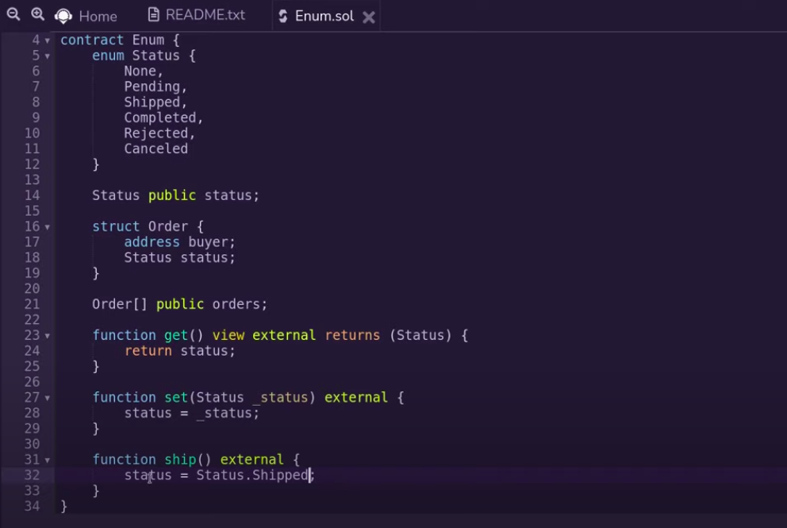
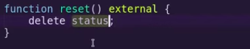

# Intermediate

## Errors

You can throw error in one of three ways:

- require
- revert
- assert

upon error throwing, gas fees is refunded and state variables that were changed are reverted. Custom errors are used to save gas.

```ts
contract Error{
    function testRequire(uint _i) public pure{
        require(_i <= 10, "i > 10");
    }

    function testRevert(uint _i) public pure{
        if(_i > 10){
            revert("i > 10");
        }
    }

    uint public num = 123;
    function testAssert() public view{
        assert(num == 123);
        // if foo was called num would be accidentally changed then assert would
        //throw an error
        // use for conditions that always need to be true
    }

    function foo() public{
        // accidentally update num
        num += 1;
    }

    // for saving gas
    error MyError(address caller, uint i);
    function testCustomError(uint _i) public view {
        if(_i > 10){
            revert MyError(msg.sender, _i);
        }
    }

}
```

## Function Modifier

It is a reusable guard of sorts before a function is executed, this can also  
sandwich functions

```ts
// SPDX-License-Identifier: MIT
pragma solidity ^0.8.7;

contract FunctionModifier{
    bool public paused;
    uint public count;

    function setPause(bool _paused) external{
        paused = _paused;
    }

    modifier whenNotPaused(){
        require(!paused, "paused");
        _;
    }

    // parameterized modifier
    modifier cap(uint _x){
        require(_x < 100, "x > 100");
        _;
    }

    // sandwich modifier
    modifier sandwich(){
        count += 10;
        _;
        count *= 2;
    }

    function inc() external whenNotPaused{
        // require(!paused, "paused");
        count += 1;
    }

    function dec(uint _x) external whenNotPaused cap(_x){
        // require(!paused, "paused");
        count -= 1;
    }
}
```

## Constructor

First function to be called upon intializing of the contract, only called once upon deployment of  
contract

```ts
// SPDX-License-Identifier: MIT
pragma solidity ^0.8.7;

contract Constructor {
    address public owner;
    uint public x;

    constructor(uint _x){
        owner = msg.sender;
        x = _x;
    }
}
```

## Function Outputs

- Return multiple output
- Named outputs
- Destructuring Assignment

```ts
// SPDX-License-Identifier: MIT
pragma solidity ^0.8.7;

contract FunctionOutput{
    function returnMany() public pure returns(uint, bool){
        return(1,true);
    }

    function named() public pure returns(uint x, bool b){
        // lesser gas since one less copy is done
        x = 1;
        b = true;
    }

    function destructuringAssignments() public pure{
        (uint x, bool b) = returnMany();
        // if you want just the second output
        (, bool b) = returnMany();
    }
}
```

## Arrays

- Dynamic or fixed size
- Initialization
- push, get, update, delete, pop, length
- creating array in memory
- returning array from function

```ts
// SPDX-License-Identifier: MIT
pragma solidity ^0.8.7;

contract Arrays{
    // dynamic array
    uint[] public nums = [1,2,3];

    // fixed size array
    uint[3] public numsFixed = [4,5,6];
    function examples() external{
        nums.push(4); // 1,2,3,4
        // can't push new element to fixed size array duh!
        uint x = nums[1];

        nums[2] = 777; // 1,2,777,4

        delete nums[1]; // deletes value at index 1 and sets to default value
        // 1, 0, 777, 4

        nums.pop(); // removes last element 1, 0, 777

        // length of array
        uint len = nums.length;

        // create array in memory
        uint[] memory a = new uint[](5); // it needs to be fixed size for in memory
    }

    // ideally not recommended as your transaction could run out of gas
    // if array is too big
    function returnArray() external view returns(uint[] memory){
        return nums;
    }

}
```

## Mapping

- declaring mapping, simple and nested
- set, get, delete
- essentially a hashmap

```ts
// SPDX-License-Identifier: MIT
pragma solidity ^0.8.7;

contract Mapping{
    // simple mapping
    mapping(address => uint) public balances;

    // nested mapping
    mapping(address => mapping(address => bool)) public isFriend;

    function examples() external{
        balances[msg.sender] = 123;
        uint bal = balances[msg.sender];
        uint bal2 = balances[address(1)]; // 0

        balances[msg.sender] += 456; // 123 + 456

        // deleting value stored
        delete balances[msg.sender]; // value reset to 0

        isFriend[msg.sender][address(1)];
    }
}
```

## Iterable Mapping

- maintain a array and a mapping which keeps track of whether that address  
  has been inserted or not



## Structs

- while initializing order doesn't matter if you use key value pair, second method mentioned
- to modify an array of structs get the indices value in a storage variable then modify it as you  
  please



```ts
    Car storage _car = cars[0];
    delete _car.owner; // resets owner address to default 0x0

    // similarly to delete an entry itself
    delete cars[1];
```

## Enum



say you wanna reset value of a enum type variable, you just delete that variable, it gets reset to the  
first value you assign on the enum in this case it is None


